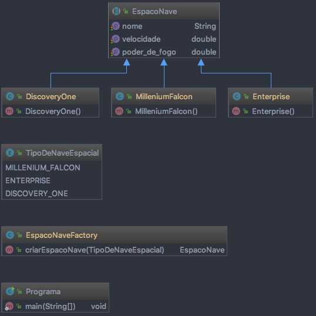

# Facade

## Definição:

Fornecer uma interface unificada para um conjunto de interfaces em um subsistema. Façade 
define uma interface de nível mais alto que torna o subsistema mais fácil de ser usado.

Composta por:

* Facade: sabe quais classes	do	subsistema são responsáveis por uma solicitação. 
Delega solicitações do	cliente aos objetos apropriados do subsistema.

* Classes do Subsistema: implementam funcionalidadedes do subsistema. Não tem 
conhecimento da	Facade.

Cenários comuns de uso:

* O padrão Façade deve ser utilziado quando deseja-se fornecer uma interface mais simples 
para um subsistemas complexo;

* Quando existirem muitas depêndencias entre clientes e classes de implementação de uma 
abstração;

* Quando se deseja estruturar os subsistemas em camadas.

## Vantagens:

* Isola os clientes dos componentes do subsistema, dessa forma reduzindo o número de 
objetos com que os clientes têm que lidar e tornando o subsistema mais fácil de usar;

* Promovem um acoplamento fraco entre o subsistema e seus clientes. As Façades ajudam a 
estratificar um sistema e as dependências entre objetos. Elas podem eliminar dependências 
complexas ou circulares. Isso pode ser uma consequência importrante quando o cliente e 
o subsistema são implementados independentemente;

* Uma façade pode simplificar a migração de sistemas para outras plataformas, porque é 
menos provável que a construção de um subsistema exija construir todos os outros;

* Não impede as aplicações de utilizarem as classes do subsistema caso necessitem fazê-lo.

## Desvantagens:

* Um problema com essa centralização de complexidade é que a classe fachada pode crescer 
descontroladamente para abrigar uma conjunto grande de possibilidades.

## Diagrama:

