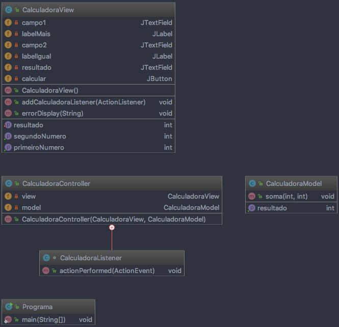

# MVC

## Definição:

Divide o software em três camadas interconectadas: Model, View e Controller.

Composto por:

* Model: 
Camada de manipulação de dados. Ela é responsável pela leitura e escrita de dados, e 
também de suas validações.

* View: 
Camada de interação do usuário. Ela apenas faz a  exibição dos dados.

* Controller: 
Controla iterações entre View e Model. Responsável por receber todas as requisições do 
usuário. Seus métodos são chamados actions são responsáveis por uma página, controlando 
qual model usar e qual view será mostrado ao usuário.

## Vantagens:

* Como o modelo MVC gerencia múltiplas views usando o mesmo modelo é fácil 
manter, testar e atualizar sistemas múltiplos;

* É muito simples incluir novos clientes apenas incluindo suas views e controllers;

* Torna a aplicação escalável;

* É possível ter desenvolvimento em paralelo para o model, view e controller 
pois são independentes.

## Desvantagens:

* Requer uma quantidade maior de tempo para analisar e modelar o sistema;

* Não é aconselhável para pequenas aplicações.

## Diagrama:

